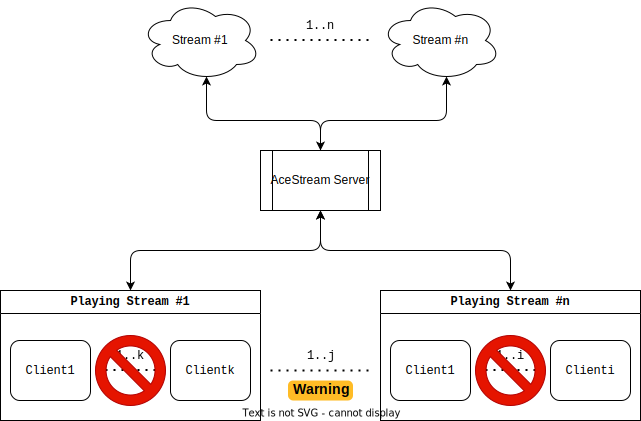
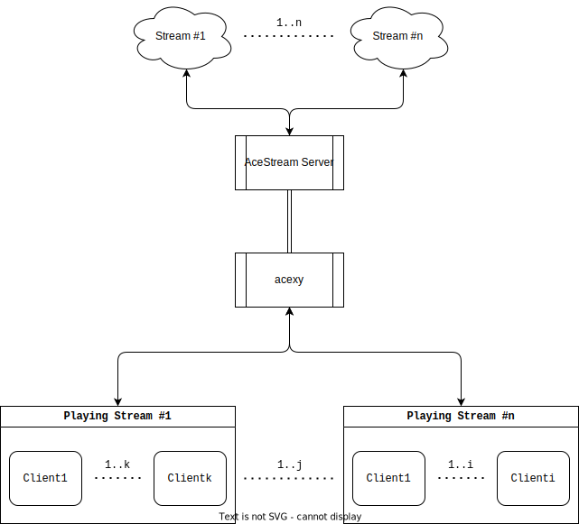

# `acexy` - An AceStream Proxy Written In Go! ⚡

[](https://github.com/Javinator9889/acexy/actions/workflows/build.yaml)
[](https://github.com/Javinator9889/acexy/actions/workflows/release.yaml)

This project is a wrapper around the
[AceStream middleware HTTP API](https://docs.acestream.net/developers/start-playback/#using-middleware), allowing both
[HLS](https://en.wikipedia.org/wiki/HTTP_Live_Streaming) and
[MPEG-TS](https://en.wikipedia.org/wiki/HTTP_Live_Streaming) playback
of a stream.

I was tired of the limitations of AceStream and some of the problems that 
exist when playing a stream 📽. For example, it is only possible to play
the same channel for **1 single client**. For having multiple clients
playing **different streams**, you must manually add a unique `pid` per 
client. If there was an error during the transmission, the **whole stream
goes down**, etc.

I found quite frustrating the experience of using AceStream in a home network
with a single server and multiple clients, to try to optimize resources. This
is the topology for which I am using AceStream:



There are some problems:

* Only **one client** can play the same stream at a time 🚫.
* Having each client to run AceStream on their own is a waste of resources
  and saturates the network 📉.
* Multiple clients can play different streams if they have a unique `pid`
  (Player ID) associated 🔓.
* The standard AceStream HTTP API is not resilient enough against errors,
  if the transmission stops it stops for every client ❌.

## Key Features 🔗

When using `acexy`, you automatically have:

* A single, centralized server running **all your AceStream streams** ⛓.
* Automatic assignation of a unique `pid` (Player ID) **per client per stream** 🪪.
* **Stream Multiplexing** 🕎: The same stream can be reproduced *at the
  same time in multiple clients*.
* **Resilient, error-proof** streaming thanks to the HTTP Middleware 🛡.
* *Blazing fast, minimal proxy* ☄ written in Go!

With this proxy, the following architecture is now possible:



## Usage 📐

`acexy` is available and published as a Docker image. Make sure you have
the latest [Docker](https://docker.com) image installed and available.

The latest release is available at the [releases page](/releases/latest),
but picking a fixed version is recommended. To run the container, just issue:

```shell
docker run -t -p 6878:6878 -p 8080:8080 ghcr.io/javinator9889/acexy
```

> **NOTE**: For your convenience, a `docker-compose.yml` file is given with
> all the possible adjustable parameters.

By default, the proxy will work in MPEG-TS mode. For switching between them,
you must add the **`-m3u8` flag** or set **`ACEXY_M3U8=true` environment
variable**.

> **NOTE**: The HLS mode - `ACEXY_M3U8` or `-m3u8` flag - is in a non-tested
> status. Using it is discouraged and not guaranteed to work.

There is a single available endpoint: `/ace/getstream` which takes the same
parameters as the standard
[AceStream Middleware/HTTP API](https://docs.acestream.net/developers/api-reference/). Therefore, for running a stream, just open the following
link in your preferred application - such as VLC:

```
http://127.0.0.1:8080/ace/getstream?id=dd1e67078381739d14beca697356ab76d49d1a2
```

where `dd1e67078381739d14beca697356ab76d49d1a2` is the ID of the AceStream 
channel.
